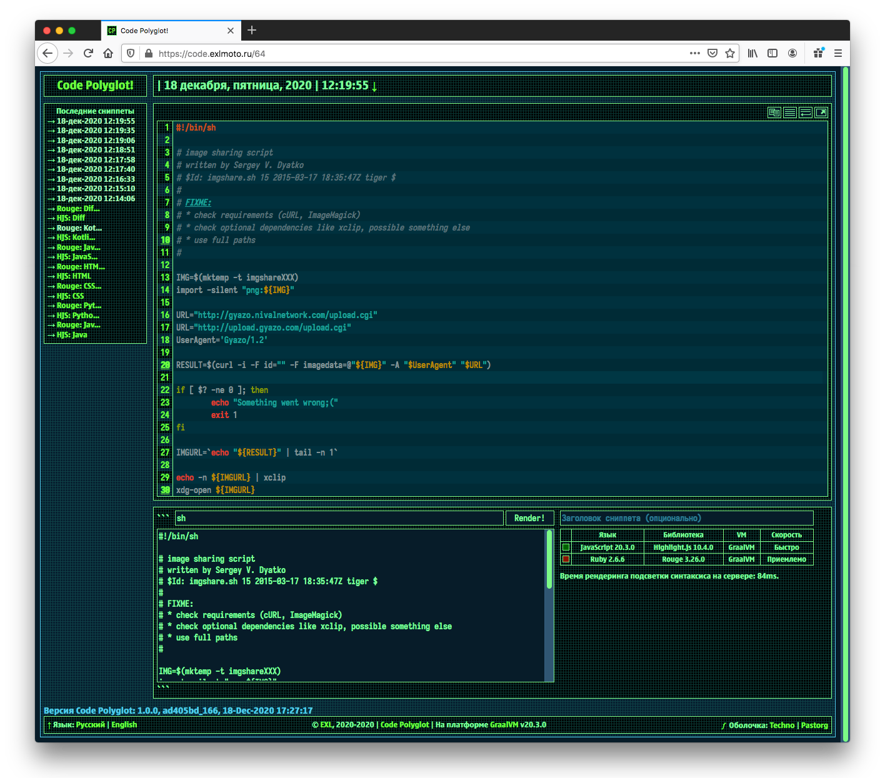

Code Polyglot
=============



Code snippets sharing service powered by [GraalVM](https://www.graalvm.org/) and [Spring Boot](https://spring.io/).

Syntax highlighting is implemented using several libraries and languages:

1. [Highlight.js](https://github.com/highlightjs/highlight.js/) and JavaScript.
2. [Rouge](https://github.com/rouge-ruby/rouge) and Ruby.
3. [Pygments](https://github.com/pygments/pygments) and Python.


*Live demo: [code.exlmoto.ru](https://code.exlmoto.ru) with Highlight.js and Rouge syntax higlighters.\
Pygments on [GraalPython](https://github.com/oracle/graalpython) are CPU and RAM intensive.

Note: Service can sometimes be offline.*

## API examples

```bash
cat file.txt | curl --data-binary @- "https://code.exlmoto.ru/api/"
cat file.xml | curl --data-binary @- "https://code.exlmoto.ru/api/?o=xml"
cat src.java | curl --data-binary @- "https://code.exlmoto.ru/api/?o=java"
cat file.xml | curl --data-binary @- "https://code.exlmoto.ru/api/?o=xml;nolines"
cat file.xml | curl --data-binary @- "https://code.exlmoto.ru/api/?o=xml;nolines;15"
cat file.xml | curl --data-binary @- "https://code.exlmoto.ru/api/?o=xml;nolines;15,20"
cat file.xml | curl --data-binary @- "https://code.exlmoto.ru/api/?o=xml;15&h=HighlightJs"
cat file.xml | curl --data-binary @- "https://code.exlmoto.ru/api/?o=xml&h=HighlightRouge"
```

## Requirements

1. [GraalVM](https://www.graalvm.org/) for running and building application *(tested with GraalVM 20.3.0 and Java 8)*.
2. [PostgreSQL](https://www.postgresql.org/) database *(tested with PostgreSQL 9.2.24)*.
3. [Nginx](https://www.nginx.com/) web server *(tested with nginx 1.16.1)*.

## Build & Deploy

For example, on CentOS 7 Linux distro.

### Recipe: Initial server settings

```bash
sudo yum -y upgrade
sudo yum -y install epel-release vim git logrotate openssh deltarpm yum-utils p7zip p7zip-plugins
sudo timedatectl set-timezone "Europe/Moscow"

git clone https://github.com/EXL/CodePolyglot
```

### Recipe: Install GraalVM

```bash
curl -LOJ https://github.com/graalvm/graalvm-ce-builds/releases/download/vm-20.3.0/graalvm-ce-java8-linux-amd64-20.3.0.tar.gz
# curl -LOJ https://github.com/graalvm/graalvm-ce-builds/releases/download/vm-20.3.0/graalvm-ce-java11-linux-amd64-20.3.0.tar.gz
cd /opt/
sudo mkdir graalvm
sudo chown `whoami`:`whoami` graalvm
cd /opt/graalvm/
tar -xvzf ~/graalvm-ce-java8-linux-amd64-20.3.0.tar.gz
rm ~/graalvm-ce-java8-linux-amd64-20.3.0.tar.gz
```

### Recipe: Install Polyglot languages and libraries

```bash
export GRAALVM_HOME=/opt/graalvm/graalvm-ce-java8-20.3.0
export JAVA_HOME=$GRAALVM_HOME
export PATH=$GRAALVM_HOME/bin:$PATH

gu install python
gu install ruby
# /opt/graalvm/graalvm-ce-java8-20.3.0/jre/languages/ruby/lib/truffle/post_install_hook.sh

graalpython -m ginstall install setuptools
curl -LOJ https://github.com/pygments/pygments/archive/2.7.2.tar.gz
tar -xvzf pygments-2.7.2.tar.gz
cd pygments-2.7.2/
graalpython setup.py install --user
cd ..
rm -Rf pygments-2.7.2/ pygments-2.7.2.tar.gz

gem install rouge
```

### Recipe: Install PostgreSQL database

```bash
sudo yum -y install postgresql-server postgresql-contrib
sudo postgresql-setup initdb # CentOS 8 command: postgresql-setup --initdb --unit postgresql
sudo systemctl start postgresql
sudo systemctl enable postgresql

sudo -i -u postgres
vim data/pg_hba.conf # Replace "ident" to "md5" or "scram-sha-256" on modern (=>10.x) PostgreSQL.

createdb code
createuser --interactive # user, n, n, n.

psql
ALTER USER user WITH PASSWORD 'password';
\q

pg_dump code > /tmp/code-service.sql # Optional. BackUp database.
psql code < /tmp/code-service.sql # Optional. Restore database.

exit

sudo systemctl restart postgresql
```

### Recipe: Install Nginx web server and Certbot

```bash
sudo firewall-cmd --zone=public --permanent --add-service=http
sudo firewall-cmd --zone=public --permanent --add-service=https
sudo firewall-cmd --reload

sudo yum -y install nginx certbot python2-certbot-nginx
sudo setsebool -P httpd_can_network_connect 1

sudo systemctl start nginx

sudo certbot certonly --nginx
echo "0 0,12 * * * root python -c 'import random; import time; time.sleep(random.random() * 3600)' && certbot renew -q" | sudo tee -a /etc/crontab > /dev/null

cd ~/CodePolyglot/
sudo cp util/nginx/code.conf /etc/nginx/conf.d/
sudo vim /etc/nginx/conf.d/code.conf # Change "code.exlmoto.ru" address to yours e.g. ":%s/code\.exlmoto\.ru/test\.exlmoto\.ru/g".

sudo systemctl restart nginx

sudo reboot

sudo systemctl enable nginx
```

### Recipe: Build and Test Code Polyglot application

```bash
export GRAALVM_HOME=/opt/graalvm/graalvm-ce-java8-20.3.0
export JAVA_HOME=$GRAALVM_HOME
export PATH=$GRAALVM_HOME/bin:$PATH

cd ~/CodePolyglot/
DB_CONNECTION=jdbc:postgresql://localhost:5432/code DB_USERNAME=user DB_PASSWORD=password ./gradlew clean build
sudo mv build/libs/code-polyglot-*.jar /srv/
```

### Recipe: Daemonize Code Polyglot application via systemd Service Manager

```bash
cd ~/CodePolyglot/
sudo cp util/systemd/code.service /etc/systemd/system/

sudo EDITOR=vim systemctl edit code

[Service]
Environment=GRAALVM_HOME=/opt/graalvm/graalvm-ce-java8-20.3.0
Environment=JAVA_HOME=$GRAALVM_HOME
Environment=PATH=$GRAALVM_HOME/bin:$PATH
Environment=DB_CONNECTION=jdbc:postgresql://localhost:5432/code
Environment=DB_USERNAME=username
Environment=DB_PASSWORD=password
Environment=CODE_USERNAME=username
Environment=CODE_PASSWORD=password

cat /etc/systemd/system/code.service.d/override.conf
sudo chmod 0600 /etc/systemd/system/code.service.d/override.conf
cat /etc/systemd/system/code.service.d/override.conf

sudo systemctl enable code
sudo systemctl start code

sudo systemctl stop code # Stop Code Polyglot application.
journalctl -u code # Show Code Polyglot logs.
journalctl -fu code # Show Code Polyglot logs dynamically.
```

## Configuration Files

1. [application.properties](src/main/resources/application.properties) is main configuration file for the Code Polyglot application.
2. [code.service](util/systemd/code.service) is systemd unit file for the Code Polyglot application.
3. [code.conf](util/nginx/code.conf) is nginx web server config file for the Code Polyglot website.

## Additional Information

Please read ["Creating Code Polyglot"](https://exlmoto.ru/code-polyglot) (in Russian) article for more information.
